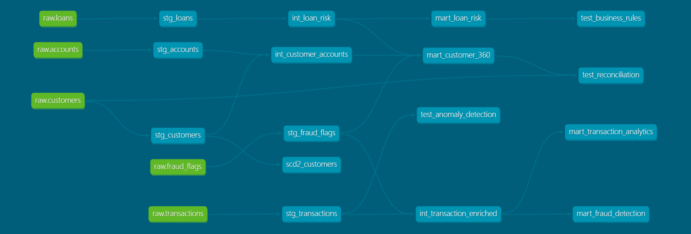

\# 🏦 Banking Data Platform — Snowflake + dbt


A production-style banking data platform built with Snowflake and dbt Core,

demonstrating end-to-end ELT pipeline design, dimensional data modeling,

and data quality practices for a regulated financial services environment.


\---


\## 📌 Project Overview


This project simulates a real banking data engineering workload covering:

\- \*\*Customer 360\*\* — unified customer profile with account, loan and fraud data

\- \*\*Transaction Analytics\*\* — monthly aggregations by channel, category and customer

\- \*\*Loan Risk Analysis\*\* — DTI ratio, LTV, risk tiering and delinquency tracking

\- \*\*Fraud Detection\*\* — fraud scoring, risk levels and customer-level fraud summaries


\---

## 📊 Data Lineage Graph



## 🏗️ Architecture

| Layer | Tool | Description |
|---|---|---|
| 1. Source | Python | CSV files generated with realistic banking data |
| 2. Raw | Snowflake | Unmodified source tables loaded via Python ELT script |
| 3. Staging | dbt views | `stg_*` models — cast, rename, clean raw data |
| 4. Intermediate | dbt views | `int_*` models — joins and business logic |
| 5. Marts | dbt tables | `mart_*` models — star schema, aggregations, risk tiers |
| 6. Consumption | BI / Compliance | Analytics, reporting, audit trails |


\---


\## 📂 Project Structure

```

banking-dbt-snowflake/

│

├── ingestion/

│   ├── generate\_data.py          # Generates realistic banking CSV data

│   └── load\_to\_snowflake.py      # Loads CSVs into Snowflake RAW schema

│

├── dbt\_project/

│   ├── models/

│   │   ├── staging/              # stg\_\* models — clean raw data

│   │   │   ├── stg\_customers.sql

│   │   │   ├── stg\_accounts.sql

│   │   │   ├── stg\_transactions.sql

│   │   │   ├── stg\_loans.sql

│   │   │   ├── stg\_fraud\_flags.sql

│   │   │   └── sources.yml

│   │   │

│   │   ├── intermediate/         # int\_\* models — business logic

│   │   │   ├── int\_customer\_accounts.sql

│   │   │   ├── int\_transaction\_enriched.sql

│   │   │   └── int\_loan\_risk.sql

│   │   │

│   │   └── marts/                # mart\_\* models — analytics ready

│   │       ├── mart\_customer\_360.sql

│   │       ├── mart\_transaction\_analytics.sql

│   │       ├── mart\_loan\_risk.sql

│   │       ├── mart\_fraud\_detection.sql

│   │       └── schema.yml

│   │

│   └── dbt\_project.yml

│

└── README.md

```


\---


\## 🔧 Tech Stack


| Tool | Purpose |

|---|---|

| Snowflake | Cloud data warehouse — storage, compute, security |

| dbt Core | Data transformation, testing, documentation, lineage |

| Python | Data generation and ELT ingestion pipeline |

| Git + GitHub | Version control and portfolio hosting |


\---


\## 📊 Data Model


| Layer | Models | Materialization |

|---|---|---|

| Staging | stg\_customers, stg\_accounts, stg\_transactions, stg\_loans, stg\_fraud\_flags | Views |

| Intermediate | int\_customer\_accounts, int\_transaction\_enriched, int\_loan\_risk | Views |

| Marts | mart\_customer\_360, mart\_transaction\_analytics, mart\_loan\_risk, mart\_fraud\_detection | Tables |


\### Key modeling concepts demonstrated

\- \*\*Star schema\*\* — fact and dimension separation in mart layer

\- \*\*SCD-ready\*\* — customer 360 mart built with unique key for incremental updates

\- \*\*Risk tiering\*\* — DTI ratio, LTV, fraud scoring with business rule logic

\- \*\*Null handling\*\* — coalesce patterns for outer join safety

\- \*\*Data quality tests\*\* — not\_null and unique constraints on all primary keys


\---


\## 🏦 Banking Domain Coverage


| Business Area | dbt Model | Key Metrics |

|---|---|---|

| Customer 360 | mart\_customer\_360 | Total balance, credit limit, fraud risk level |

| Transaction Analytics | mart\_transaction\_analytics | Monthly spend, channel mix, flagged count |

| Loan Risk | mart\_loan\_risk | DTI ratio, LTV, risk tier, delinquency flag |

| Fraud Detection | mart\_fraud\_detection | Fraud score, risk level, flagged transactions |


\---


\## ✅ Data Quality


\- 8 automated dbt tests across all mart models

\- not\_null tests on all primary and critical business keys

\- unique tests on customer\_id, loan\_id, fraud customer\_id

\- All tests passing: PASS=8 WARN=0 ERROR=0


\---


\## 🚀 How to Run


\### Prerequisites

\- Python 3.8+

\- Snowflake account

\- dbt Core with dbt-snowflake adapter


\### Setup


\*\*1. Clone the repo\*\*

```bash

git clone https://github.com/akshayd0915-hash/snowflake.git

cd snowflake

```


\*\*2. Install dependencies\*\*

```bash

pip install dbt-snowflake snowflake-connector-python

```


\*\*3. Configure dbt profile\*\*


Create `\~/.dbt/profiles.yml`:

```yaml

dbt\_project:

&#x20; outputs:

&#x20;   dev:

&#x20;     type: snowflake

&#x20;     account: <your\_account>

&#x20;     user: <your\_username>

&#x20;     password: <your\_password>

&#x20;     role: ACCOUNTADMIN

&#x20;     warehouse: COMPUTE\_WH

&#x20;     database: BANKING\_DW

&#x20;     schema: DBT\_DEV

&#x20;     threads: 4

&#x20; target: dev

```


\*\*4. Generate and load data\*\*

```bash

python ingestion/generate\_data.py

python ingestion/load\_to\_snowflake.py

```


\*\*5. Run dbt models\*\*

```bash

cd dbt\_project

dbt run

dbt test

```


\*\*6. View data lineage\*\*

```bash

dbt docs generate

dbt docs serve

```


\---


\## 📈 Data Volume


| Table | Rows |

|---|---|

| RAW.customers | 200 |

| RAW.accounts | 350 |

| RAW.transactions | 2,000 |

| RAW.loans | 150 |

| RAW.fraud\_flags | 100 |


\---


\## 👤 Author


Built by Akshay Dubey as a portfolio project targeting

data engineering roles in the banking and financial services domain.

